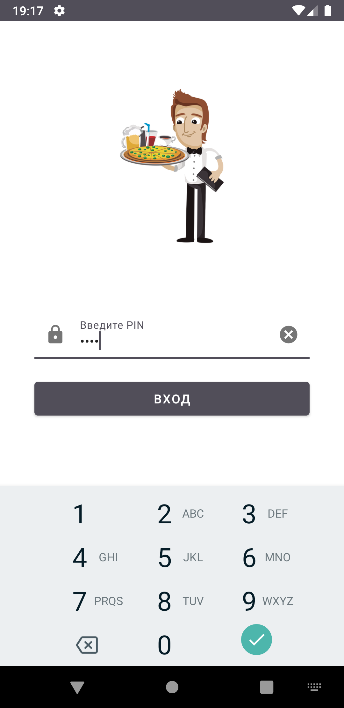
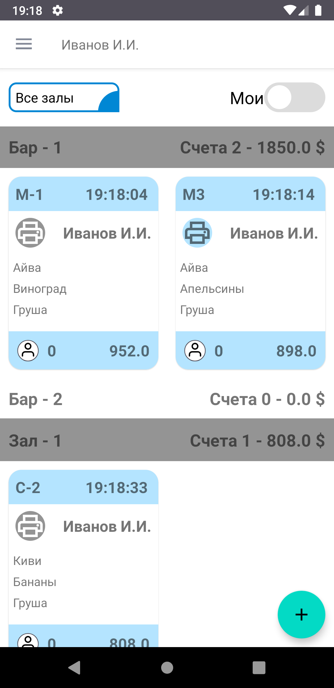
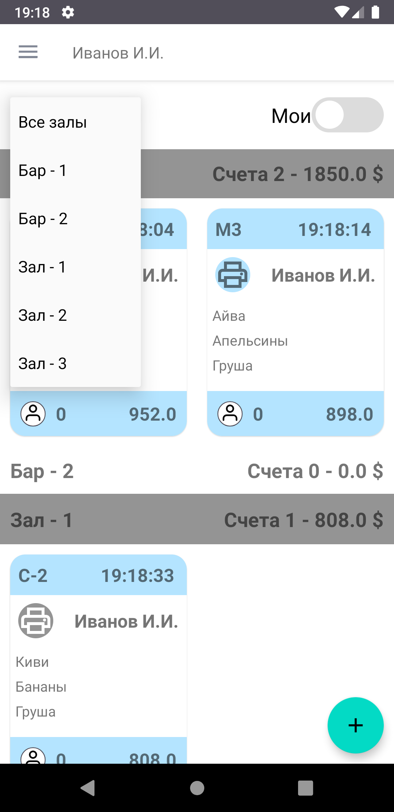
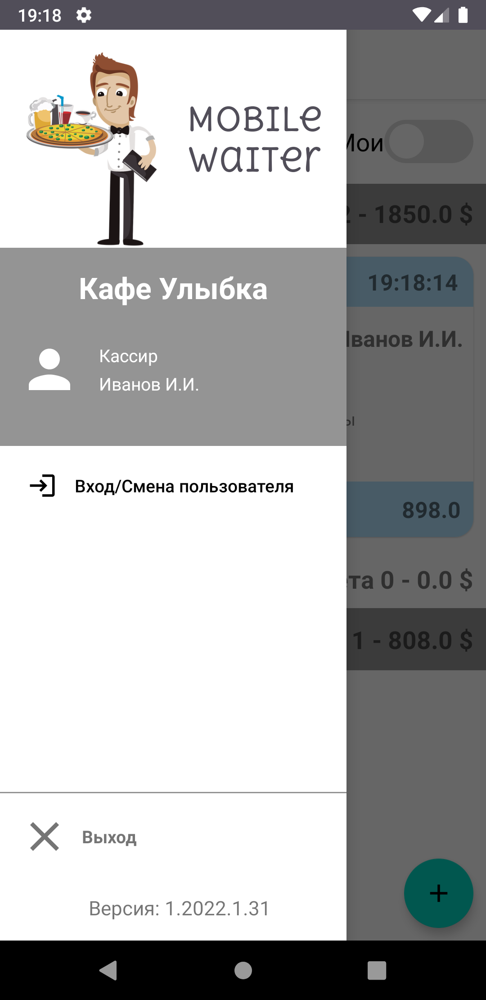
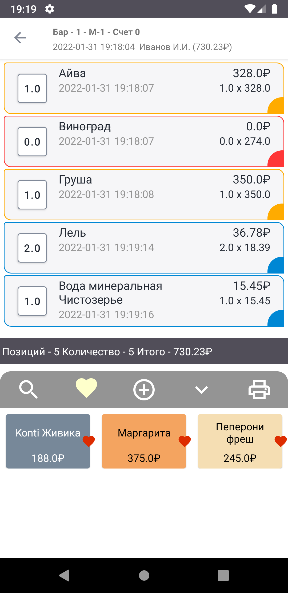
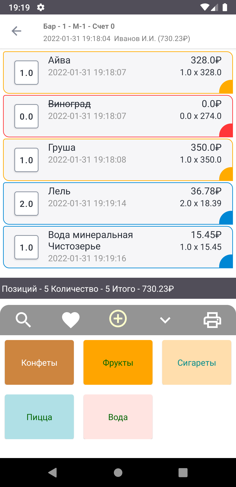
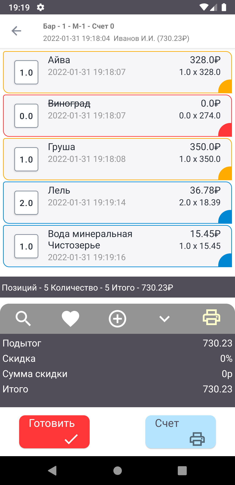
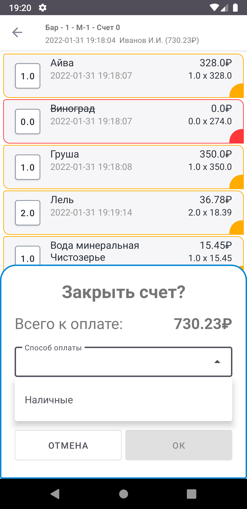

### Факультет: Android - разработка.

Курс: ***Командная разработка Android-приложения***

Студент GeekBrains: ***Александров Илья (@ilya_aleksandrov)***

Студент GeekBrains: ***Королёв Денис (@GeologDen)***

Студент GeekBrains: ***Шайхисламов Руслан (@RuslanShaykh)***

Студент GeekBrains: ***Шейнмаер Иван (@UBaH4UkDev)***

### Приложение "Mobile Waiter - Мобильный официант".

###
---

   Приложение предназначено для автоматизации приема заказов персоналом в ресторанах, клубах, кафе 
и других предприятиях общественного питания.
    Приложение позволяет ускорить обслуживание клиентов за счет сокращения перемещений официантов по залу, 
а также оперативному уведомлению кухни о поступлении новых заказов.
    Приложение служит для быстрого оформления заказа клиента, мгновенного уведомления сотрудников кухни 
о необходимости готовки нужного блюда/блюд и получения уведомления о готовности блюд с кухни. 
Все это позволяет избежать лишних перемещений официанта, что дает возможность ускорить прием и оформление заказа у клиента.

####

